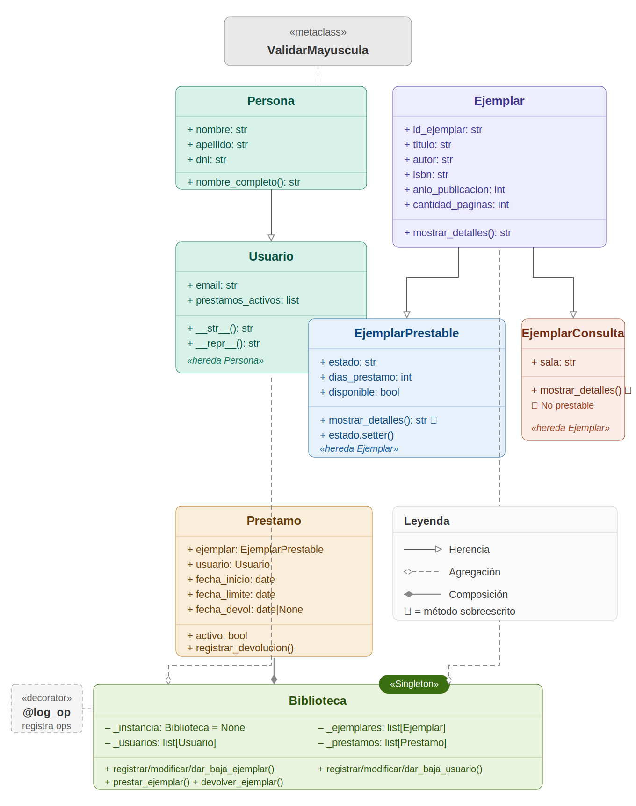

# Sistema de Gestión de Biblioteca

**Trabajo Práctico Final — Programación Avanzada (189)**  
Licenciatura en Ciencia de Datos · Universidad Nacional Guillermo Brown (UNAB)

---

## Integrantes

| Nombre | GitHub |
|--------|--------|
| Julián Sánchez | [@jmsanchez10](https://github.com/jmsanchez10) |
| Franco Gómez | — |

---

## Descripción

Sistema de gestión de una biblioteca física desarrollado en Python con Programación Orientada a Objetos. Permite administrar ejemplares físicos (libros), usuarios y préstamos a través de una interfaz gráfica de escritorio construida con `tkinter`.

El sistema implementa todos los requerimientos técnicos de la materia:

| Requerimiento | Implementación |
|---------------|---------------|
| Herencia | `Persona → Usuario` / `Ejemplar → EjemplarPrestable, EjemplarConsulta` |
| Polimorfismo | `mostrar_detalles()` sobreescrito en cada subclase |
| Agregación | `Biblioteca` contiene listas de `Ejemplar` y `Usuario` |
| Composición | `Biblioteca` crea y destruye objetos `Prestamo` |
| Decorador propio | `@log_operacion` en `utils.py` — registra toda operación en consola |
| Metaclase | `ValidarMayuscula(type)` — valida nombres de clase en tiempo de definición |
| Patrón de diseño | Singleton en `Biblioteca` — garantiza una única instancia del sistema |

---

## Estructura del proyecto

```
tp_biblioteca/
├── utils.py          # Metaclase ValidarMayuscula + decorador @log_operacion
├── modelos.py        # Persona, Usuario, Ejemplar, EjemplarPrestable, EjemplarConsulta
├── biblioteca.py     # Prestamo + Biblioteca (Singleton)
├── app.py            # Interfaz gráfica (tkinter)
├── main.py           # Demostración por consola de todos los requerimientos
├── diagrama_uml.png  # Diagrama UML del sistema
└── README.md
```

---

## Requisitos

- Python 3.10 o superior
- `tkinter` (incluido en la instalación estándar de Python)
- Sin dependencias externas adicionales

Para verificar tu versión de Python:
```bash
python --version
```

---

## Cómo ejecutar

### Interfaz gráfica (recomendado)
```bash
cd tp_biblioteca
python app.py
```

### Demostración por consola
```bash
cd tp_biblioteca
python main.py
```

---

## Diagrama UML



---

## Justificación del patrón Singleton

La clase `Biblioteca` implementa el patrón Singleton porque el sistema no puede tener dos instancias simultáneas: si existieran dos objetos `Biblioteca`, podrían registrar préstamos distintos para el mismo ejemplar, generando inconsistencias en el catálogo. El Singleton garantiza que todos los módulos del sistema compartan el mismo catálogo, los mismos usuarios y el mismo historial de préstamos.

```python
bib1 = Biblioteca("Biblioteca Central")
bib2 = Biblioteca("Otra instancia")
print(bib1 is bib2)  # True — siempre la misma instancia
```
